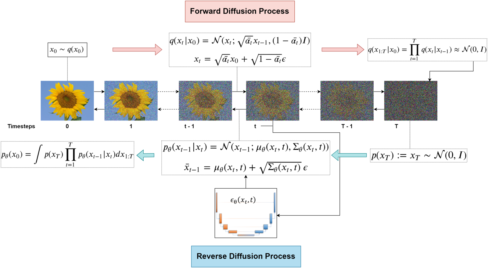
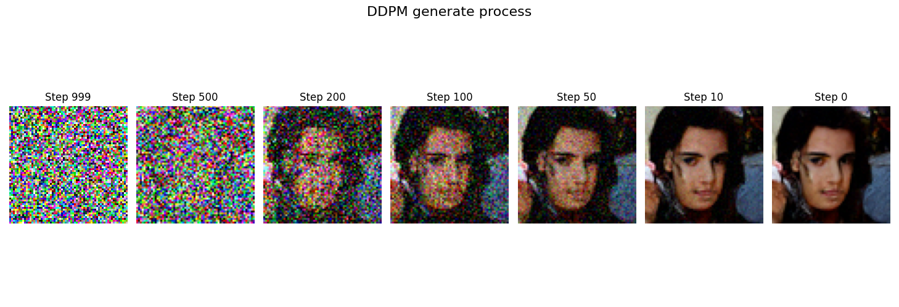
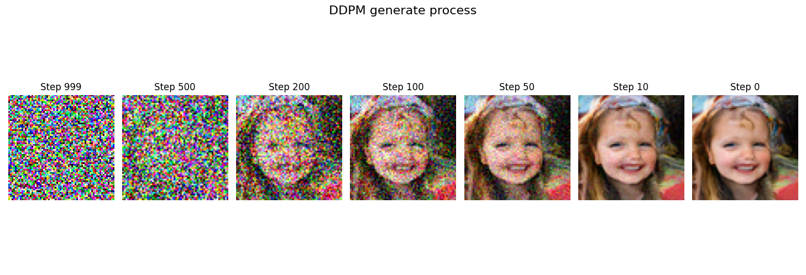
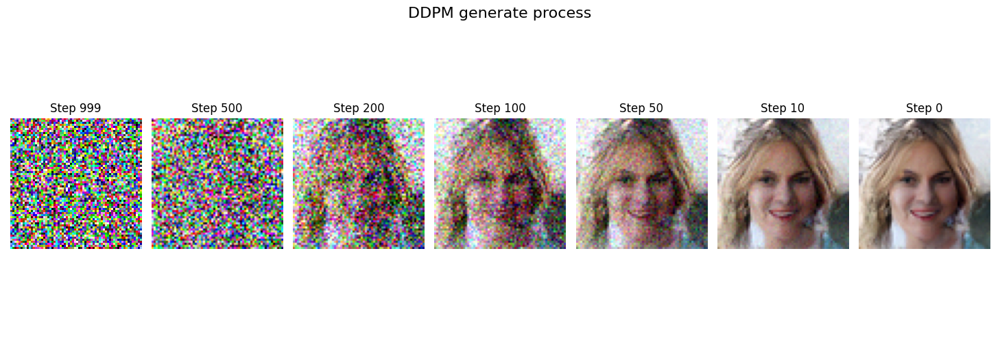

# DDPM + UNet 的简单实现

这是一个基于PyTorch实现的简单DDPM（Denoising Diffusion Probabilistic Models）项目，使用UNet作为骨干网络进行图像生成。

## 算法原理

### DDPM扩散过程

DDPM通过正向扩散过程逐步向图像添加噪声，然后训练神经网络学习反向去噪过程：



### UNet网络架构

项目使用UNet作为去噪网络的骨干架构，通过编码器-解码器结构和跳跃连接实现特征提取和重建：


## 生成效果展示

以下是使用预训练权重生成的人脸图像效果：

<div align="center">
  
  
  
</div>

*使用FFHQ-64x64数据集训练的模型生成的64x64像素人脸图像*

## 项目特点

- 🎯 **简单易懂**: 代码结构清晰，注释详细，适合学习DDPM原理
- 🚀 **完整实现**: 包含训练、推理、可视化等完整功能
- 📊 **监控训练**: 支持TensorBoard监控训练过程
- 🔧 **灵活配置**: 通过config.py轻松调整超参数
- 🎨 **图像生成**: 支持从噪声生成64x64像素的图像
- ⚡ **高效训练**: 算力要求不高，在FFHQ-64x64数据集上约100轮收敛
- 🎁 **预训练权重**: 提供10、150、800轮训练的权重文件，可直接测试

## 项目结构

```
SimpleDDPM/
├── main.py              # 训练脚本
├── test.py              # 推理和生成脚本
├── ddpm.py              # DDPM核心实现
├── unet.py              # UNet网络架构
├── unet_sample.py       # UNet示例实现
├── config.py            # 配置文件
├── utils.py             # 工具函数
├── positional_encoding.py # 位置编码实现
├── requirements.txt     # 依赖包列表
└── readme.md           # 项目说明
```

## 环境要求

- Python 3.7+
- PyTorch 1.9.0+
- CUDA支持（可选，用于GPU加速）

## 安装

1. **克隆项目**
   ```bash
   git clone https://github.com/zixiao-bios/SimpleDDPM.git
   cd SimpleDDPM
   ```

2. **安装依赖**
   ```bash
   pip install -r requirements.txt
   ```

3. **下载数据集**
   
   推荐使用 [FFHQ-64x64](https://huggingface.co/datasets/Dmini/FFHQ-64x64) 数据集：
   
   ```bash
   # 克隆数据集到本地
   git lfs install
   git clone https://huggingface.co/datasets/Dmini/FFHQ-64x64
   
   # 解压数据集
   cd FFHQ-64x64
   unzip ffhq-64x64.zip
   # 数据集包含70,000张64x64像素的人脸图像

   # 数据集的图片分成了多个文件夹，移动到一个统一文件夹中
   mkdir imgs
   mv 00* imgs/
   
   # 修改 config 中的 img_path 为上面创建的 imgs 文件夹路径
   ```
   
   数据集信息：
   - **大小**: 878 MB（原始文件）/ 815 MB（Parquet格式）
   - **图像数量**: 70,000张
   - **图像尺寸**: 64x64像素
   - **格式**: imagefolder格式，支持常见图像格式（jpg, png等）
   
   或者使用其他64x64像素的图像数据集，确保修改`config.py`中的`img_path`参数。

## 配置

在 `config.py` 中可以调整以下参数：

```python
# DDPM 参数
n_steps = 1000          # 扩散步数
min_beta = 1e-4         # 最小噪声调度
max_beta = 0.02         # 最大噪声调度

# UNet 参数
pe_dim = 10             # 位置编码维度
channels = [30, 60, 100, 180]  # 各层通道数
residual = True         # 是否使用残差连接

# 训练参数
num_workers = 6         # 数据加载器工作进程数
batch_size = 128        # 批次大小
lr = 1e-3              # 学习率
epochs = 800            # 训练轮数

# 数据集参数
img_path = "/workspace/FFHQ-64x64/imgs"  # 数据集路径，根据实际下载位置调整
input_shape = (3, 64, 64)                # 输入图像形状
```

## 使用方法

### 训练模型

```bash
python main.py
```

训练过程中会：
- 自动检测并使用可用的设备（CUDA/MPS/CPU）
- 显示训练进度和损失信息
- 每2个epoch保存模型权重到 `weights/` 目录
- 记录训练日志到TensorBoard

#### 训练性能

在FFHQ-64x64数据集上使用默认参数训练：
- **收敛轮数**: 约100轮网络开始收敛，生成质量明显提升
- **算力要求**: 训练对硬件要求不高，适合个人学习使用
  - M1 Pro MacBook: 约5分钟/轮
  - RTX 5090: 约25秒/轮
  - 其他设备可根据性能按比例估算

#### 预训练权重

为了方便测试，项目提供了在默认参数下预训练的权重文件：
- `example_weights/unet_weights_10.pth` - 训练10轮的权重
- `example_weights/unet_weights_150.pth` - 训练150轮的权重  
- `example_weights/unet_weights_800.pth` - 训练800轮的权重

可以直接使用这些权重运行`test.py`测试生成效果，无需重新训练。

### 生成图像

```bash
python test.py
```

生成过程会：
- 加载训练好的模型权重
- 从随机噪声开始生成图像
- 显示生成的过程和最终结果

### 监控训练

```bash
tensorboard --logdir logs
```

然后在浏览器中打开 `http://localhost:6006` 查看训练曲线。

## 核心组件

### DDPM (ddpm.py)
- 实现扩散过程的前向和反向采样
- 噪声调度和采样策略
- 支持自定义时间步数

### UNet (unet.py)
- 编码器-解码器架构
- 时间步嵌入
- 跳跃连接
- 残差块支持

### 位置编码 (positional_encoding.py)
- 正弦余弦位置编码
- 用于时间步嵌入

## 训练技巧

1. **学习率调度**: 使用余弦退火调度器，学习率从1e-3逐渐降低到1e-5
2. **批次大小**: 根据GPU内存调整batch_size
3. **数据增强**: 在config.py中可以添加数据增强策略
4. **早停**: 监控验证损失，避免过拟合

## 常见问题

**Q: 训练时显存不足怎么办？**
A: 减小batch_size或使用梯度累积

**Q: 生成的图像质量不好？**
A: 增加训练轮数，调整学习率，检查数据集质量

**Q: 如何更换数据集？**
A: 修改config.py中的img_path和input_shape参数

**Q: 下载数据集时遇到问题怎么办？**
A: 确保已安装git-lfs，如果下载速度慢可以尝试使用镜像源或手动下载

## 许可证

本项目仅供学习和研究使用。

## 贡献

欢迎提交Issue和Pull Request来改进项目！

## 参考资料

- [Denoising Diffusion Probabilistic Models](https://arxiv.org/abs/2006.11239)
- [U-Net: Convolutional Networks for Biomedical Image Segmentation](https://arxiv.org/abs/1505.04597)
